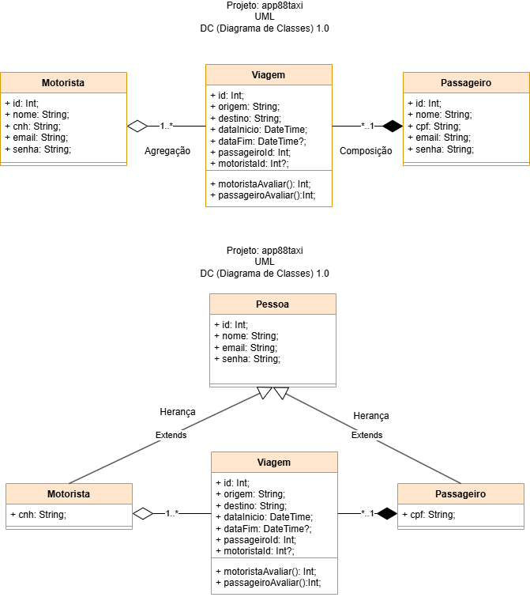

# Projeto: app88taxi
Exemplo de projeto de um aplicativo de taxi utilizado o framework Node.js e o banco de dados MYSQL.
# Tecnologias utilizadas
- Node.js
- Prisma
-MYSQL (XAMPP)
- Insomnia
## Estrutura do Projeto
